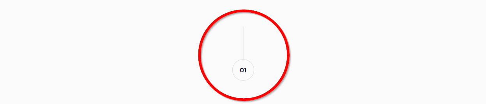

<p align="left">
  <a href="https://www.frontendmentor.io/challenges?difficulties=1" target="_blank"></a>
  
  <a href="https://twitter.com/vanzasetia" target="_blank"></a>
  
  
  
</p>

<p>
  <a href="http://jigsaw.w3.org/css-validator/check/referer">
    
    </a>
</p>

# Meet Landing Page Challenge

## Table of contents
- [Overview](#overview)
  - [Introduction](#introduction)
  - [The challenge](#the-challenge)
  - [Links](#links)
  - [Screenshots](#screenshots)
- [My process](#my-process)
  - [Built with](#built-with)
  - [What I learned](#what-i-learned)
- [Author](#author)
- [Acknowledgements](#acknowledgements)
- [License](#license)
- [References](#references)

## Overview
[(Back to top)](#table-of-contents)

### Introduction
Welcome to the `README.md` of this repo! The purpose of creating this project is to sharpen my coding skill.

In this file I'm going to tell you everything, starting from tools that I used, and much more.

That's it for the introduction and **happy reading!**
### The Challenge
The challenge is to build out this landing page and get it looking as close to the design as possible.

The users should be able to:
- View the optimal layout depending on their device's screen size
- See hover states for interactive elements
- Explore the site using screen reader
- See focus visible states for interactive elements

### Links
- [🌐 Live Review](https://officialmeet.netlify.app/)
- [👨‍🏫 Frontend Mentor Solution Page](https://www.frontendmentor.io/solutions/meet-landing-page-html-css-sass-aCWhmZKRk)

### Screenshots


## My Process
[(Back to top)](#table-of-contents)

### Built With
- **Following best practices**\* 
- HTML Semantic Tags
- [BEM (Block, Element, Modifier)](https://sparkbox.com/foundry/bem_by_example) Class *Naming Convention*
- [Sass](https://sass-lang.com/)
- CSS Flexbox
- Mobile-first workflow
- [Normalize.css](https://necolas.github.io/normalize.css/)

> * I follow guidelines. [See what guidelines that I follow.](./docs/README.md#guidelines)

### What I Learned

#### Advanced Pseudo-Elements



The problem is the element is just a decoration. So, if I used an actual element on the HTML, it might be look something like this:

```html
<div class="number" aria-hidden="true">
  <p class="number__value">01</p>
</div>
```

And that is okay, but I wanted to create it as a *decorative element*. So, I thought, *"Why don't use pseudo-elements? But, is it possible?"*. Luckily, **it is possible!**

As the result, I managed to create it with **100%** pseudo-elements. Let me explain how I did that.
- First, on the HTML, I added the `number` class to the `section` and a modifier class (`number--one`) for the `content` of the number.

```html
<section class="feature number number--one">
</section>
```

- Second, I made the `number` element as `position: relative;`
- Third, I made the pseudo-elements center horizontally using absolute positioning.
```css
/**
 * 1. This is temporary code. It used to
 * to create the circle and the vertical line
 */
.number::after,
.number::before {
  content: ""; /* 1 */
  position: absolute;
  left: 50%;
  transform: translateX(-50%);
}
```
- Fourth, I used the `::after` as the circle and the `::before` as the vertical line.
- Lastly, after everything was set up, I removed the temporary `content` property and wrote each number on the modifier class.
```css
.number--one::after {
  content: "01";
}

.number--two::after {
  content: "02";
}
```

> If you want to know the complete code, see [_number.scss](./scss/components/_number.scss)

## Author
[(Back to top)](#table-of-contents)

- Frontend Mentor - [@vanzasetia](https://frontendmentor.io/profile/vanzasetia)
- Twitter - [@vanzasetia](https://twitter.com/vanzasetia)
- Code Newbie - [@vanzasetia](https://community.codenewbie.org/vanzasetia)
- Want to see me on other platform? [Check my linktree!](https://linktr.ee/vanzasetia)

## Acknowledgements
[(Back to top)](#table-of-contents)

## License
[(Back to top)](#table-of-contents)

>You can check out [the full license](./LICENSE)

This project is licensed under the terms of the MIT license.

For those of you who are wondering, why do I need to license this? 
- Well, first it's free 😁.
- Second I checked this [Choose license website](https://choosealicense.com/) to help me chose a license.
- The last reason, if I don't want to choose a license, then [here's what gonna happen](https://choosealicense.com/no-permission/).

## References

[(Back to top)](#table-of-contents)

> See the [documentation.](./docs/README.md)
